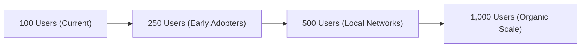

# NorthPaw: Deep-Dive User Acquisition & Growth Hacking Playbook

This document serves as a comprehensive growth strategy and resource manual for **NorthPaw**. It is designed to be loaded directly into **NotebookLM** to facilitate a deep-dive strategic discussion, or used as a standalone guide for executing immediate growth hacks, ad campaigns, outreach, and social media pushes.

---

## 📋 Table of Contents
1. **The Ultimate Deep-Thinking Growth Prompt** (Copy-pasteable for external LLMs)
2. **Growth Milestones & Focus Segments**
3. **Light Ad Marketing (Weather-Triggered & Geofenced)**
4. **Cold Outreach & B2B2C Partnerships (Vets, Shelters, Walkers)**
5. **In-Person (IRL) Activations & The "IRL Heat Map" Experiment**
6. **Platform Playbooks (Twitter, Reddit, IG, TikTok/Shorts)**
7. **AI-Generated Content & Video Creation Frameworks**
8. **Growth Hacking Loops & In-App Virality**
9. **Briefing Docs, Press Pitch, & Media Kit Outlines**
10. **Ready-to-Use User Acquisition Campaign Prompts**

---

## 1. The Ultimate Deep-Thinking Growth Prompt
*If you want to run this task again in another high-reasoning model or a fresh session, copy and paste this exact prompt:*

```text
You are an elite Growth Hacker and Fractional CMO specializing in mobile app growth, viral loops, and organic user acquisition. 

Analyze the provided documentation for NorthPaw (an iOS utility app that models canine thermodynamic pavement temperature and heat stress using localized physics). 

Generate a highly structured, comprehensive, and hyper-actionable growth playbook to take NorthPaw from 100 users to 1,000 weekly active users (WAUs) and beyond. 

Your playbook must cover:
1. LIGHT AD MARKETING: Low-budget, geofenced, weather-triggered ad campaigns.
2. COLD OUTREACH: Templates and lists targeting local veterinary clinics, shelters, and dog walkers.
3. IN-PERSON (IRL) ACTIVATIONS: Low-cost physical events (e.g., dog parks, farmer's markets) using sensory contrasts.
4. SOCIAL MEDIA STRATEGY: Tailored approaches for Twitter, Reddit (niche subreddits), Instagram, and YouTube Shorts/TikTok, including storyboards.
5. AI-GENERATED CAMPAIGNS: Concrete Midjourney, Luma/Runway video, and copy prompts.
6. GROWTH HACKING LOOPS: Organic, in-app referral mechanics and share triggers (e.g., weather alerts).
7. BRIEFING DOCS & MEDIA KITS: Templates for reaching local media, news outlets, and dog blogs.

Ensure every suggestion is customized specifically to NorthPaw's unique selling points: its science-backed NPI algorithm, snout/coat calibration, offline-first performance, and its strictly free, no-subscription model.
```

---

## 2. Growth Milestones & Focus Segments

To scale efficiently, NorthPaw must transition from general "dog lovers" to hyper-specific, high-intent user cohorts.

### Target User Segments
1. **The "Flat-Faced" (Brachycephalic) Cohort:** Owners of Pugs, French Bulldogs, Boston Terriers, and Boxers. These dogs have compressed airways and struggle significantly to cool down via panting. Pavement temperature and high humidity are existential threats to them.
2. **The "Thick Coat" Cohort:** Owners of Huskies, Malamutes, Samoyeds, and Golden Retrievers. These dogs retain heat rapidly and require earlier morning walks.
3. **The "Active Athlete" Cohort:** Dog owners who run, hike, or jog with their dogs. They need to know pavement and dirt trail safety window forecasts.
4. **The "Greyhound/Thin-Skin" Cohort:** Breeds like Whippets, Greyhounds, and Italian Greyhounds that have thin skin, low body fat, and fragile paw pads.

### Key Milestones

*   **Milestone 1 (250 Users):** Focus on localized vet clinic and shelter flyer drops, and high-value Reddit posts.
*   **Milestone 2 (500 Users):** Set up weather-triggered Instagram ads and local in-person park tests.
*   **Milestone 3 (1,000 Users):** Establish national breed club newsletters, shelter onboarding kits, and press coverage.

---

## 3. Light Ad Marketing (Weather-Triggered & Geofenced)

Because NorthPaw is free and bootstrapped, traditional broad-targeted advertising will waste budget. Instead, use **Trigger-Based Hyper-Local Advertising**.

### Meta / Google Ads Weather-Triggered Playbook
Instead of running ads continuously, set up campaigns that only turn on when local weather conditions cross dangerous thresholds (e.g., air temperature $\ge 80^\circ\text{F}$ or NPI $\ge 6.0$).

*   **Platform:** Meta Ads Manager (Instagram/Facebook) & Google Search Ads.
*   **Geotargeting:** Focus on cities known for hot summers, high asphalt density, and high pet ownership (e.g., Austin, Phoenix, Atlanta, Miami, Los Angeles).
*   **Automation Trick:** Use integration tools like **Zapier** or **Revealbot** connected to a weather API (like OpenWeatherMap). When the temperature in a target ZIP code crosses $82^\circ\text{F}$, automatically activate the ad set. When the temperature drops, pause it.

### Ad Creative Variations

#### Variation A: The Science-First Callout (Targeting General Conscientious Owners)
*   **Visual:** Split-screen image. Left side: Thermographic camera overlay showing $140^\circ\text{F}$ asphalt. Right side: A dog's paw pad.
*   **Headline:** "Air is 80°F. The road is 140°F. Is it safe to walk?"
*   **Body Copy:** "You can't feel what they feel. Before you grab the leash, check the NorthPaw Index (NPI). NorthPaw calibrates pavement temperature, wind, humidity, and your dog's snout/coat profile to calculate their personal safety index. 100% free. No ads. No subscriptions."
*   **Call to Action (CTA):** Install Now.

#### Variation B: The Pug & Frenchie Alert (Targeting Brachycephalic Owners)
*   **Visual:** A close-up, high-quality photo of a happy French Bulldog panting, with an NPI Dial showing a warning zone (e.g., 7.2).
*   **Headline:** "Flat-faced dogs cool 15% slower in humidity."
*   **Body Copy:** "Pugs and Frenchies struggle to pant away heat. Even a warm morning walk can trigger heatstroke. NorthPaw calculates customized walk windows tailored directly to your dog's snout shape, coat type, and color. Keep your best friend safe this summer."
*   **CTA:** Get Free App.

---

## 4. Cold Outreach & B2B2C Partnerships

Cold outreach should focus on trusted intermediaries who already have the ears of dog owners: veterinarians, shelters, rescues, and professional dog walkers.

### Vet Clinic Partnership Pack
Veterinarians see paw burns and heat exhaustion cases every summer. NorthPaw serves as a preventative tool they can recommend to clients.

*   **The Angle:** "We want to help reduce your summer heat-stress cases. NorthPaw is a completely free, ad-free app built using thermodynamic physics."
*   **Outreach Script (Email to Practice Managers):**
    > **Subject:** Free prevention tool for paw burns & canine heat stress
    >
    > Hi [Practice Manager Name],
    >
    > Every summer, vet clinics see a spike in painful paw burns and heatstroke. Often, owners just don't realize that 80-degree air means 140-degree asphalt.
    >
    > To help prevent this, we've developed **NorthPaw**—a completely free iOS utility that calculates a customized safety index (NPI) based on local pavement physics and a dog's breed/biology (snout profile, coat style).
    >
    > There are no ads, no subscriptions, and we don't sell data. It's built purely as a community safety tool. 
    >
    > Would you be open to putting a small, beautiful safety placard with a download QR code on your reception desk? We’d love to send you a few for free.
    >
    > Best regards,  
    > [Your Name]  
    > Founder, NorthPaw App

### Rescue & Shelter Onboarding Kits
When a dog is adopted, owners receive a folder of information. NorthPaw should be listed under "Essential Safety Apps."

*   **The Pitch:** Partner with local humane societies and breed-specific rescues (e.g., Greyhound rescues, Pug rescues). Provide them with a PDF flyer containing a QR code linked directly to the App Store.
*   **The Incentive:** Offer to co-brand the digital flyer with the rescue's logo, showing that the shelter is looking out for the dog's ongoing safety.

---

## 5. In-Person (IRL) Activations & The "IRL Heat Map" Experiment

In-person marketing creates high emotional impact and generates organic social media content.

### The "IRL Heat Map" Campaign
Set up a small pop-up station at a local dog park entry point or a busy weekend farmers' market on a sunny day.

```text
[  PHYSICAL BOOTH  ]
Headline: "HOW HOT IS THE ROAD RIGHT NOW?"
[ Infra-Red Temp Gun ] ---> [ Interactive Blackboard with Real-Time Temps ]
[ Asphalt: 138°F ]  [ Grass: 78°F ]  [ Artificial Turf: 145°F ]
CTA: "Scan to Check Your Dog's Personal Safety Index" (QR Code)
```

*   **Materials Needed:**
    1. A high-accuracy infrared temperature gun ($20 on Amazon).
    2. A large, readable sandwich board or chalkboard.
    3. Printed cards with a QR code and a simple thermodynamic conversion chart.
*   **The Interaction:**
    *   Ask passing dog owners: *"Do you know how hot the path you just walked on is?"*
    *   Zap the pavement, grass, and dirt in front of them with the temp gun. 
    *   Write the live numbers on the chalkboard. Point out how turf or asphalt is dramatically hotter than the air.
    *   Hand them a card: *"This app (NorthPaw) simulates this thermodynamic heat in real time for your exact location, customized to your dog's snout and coat type. It's completely free."*
*   **The Content Loop:** Record video clips of owner reactions when they see the temperature gun hit $140^\circ\text{F}$. Use these reactions to create TikToks/Shorts.

---

## 6. Platform Playbooks (Twitter, Reddit, IG, Shorts)

### Reddit Strategy (Value-First Engagement)
Reddit communities hate self-promotion, but they love data, safety tips, and indie hacking stories.

*   **Target Subreddits:** `r/dogs`, `r/puppy101`, `r/Frenchbulldogs`, `r/Huskies`, `r/Whippets`, `r/everydaycarry` (as a safety tool), `r/reactivedogs` (using optimal windows to avoid heat and crowded walks).
*   **The "Indie Hacker" Post Structure:**
    *   **Subreddit:** `r/puppy101` or `r/dogs`
    *   **Title:** "Why the '7-second hand test' for pavement can lie, and how I built a free thermodynamic app to solve it"
    *   **Content:**
        1. Explain the physics: Air temperature is measured in shade. Pavement is baked by solar radiation, attenuated by cloud cover, and cooled by wind speed.
        2. Introduce the algorithm: Mention the math behind concrete, grass, and artificial turf.
        3. Explain the breed adjustments: Why brachycephalic dogs have a +15% penalty due to panting efficiency.
        4. State clearly: *"I built this app because I wanted my own dog to be safe. It's 100% free, no ads, no subscriptions, and works offline. I just want feedback from fellow owners."*

### Twitter / Threads Playbook
Position NorthPaw as the leading authority on canine heat safety.

*   **Content Pillars:**
    *   **Weekly Heat Alerts:** Share charts showing pavement temperatures in major cities compared to air temperatures.
    *   **Thermodynamic Explainer Threads:** Multi-part threads breaking down solar zenith angles, material heat capacities (why turf is hotter than asphalt), and canine thermal regulation.
    *   **Interactive Spotlights:** Ask users to post photos of their dogs to get a simulated NPI score in the comments.

### Instagram & TikTok/Shorts Playbook
Focus on visual shock value and emotional hooks.

*   **The "Paws vs. Pavement" Storyboard (60 Seconds):**
    *   **0:00 - 0:03:** Fast hook. Close up of a dog's paws stepping onto black asphalt. Text overlay: *"Stop walking your dog at 2 PM."*
    *   **0:03 - 0:10:** Host zaps asphalt with an infrared temp gun showing $142^\circ\text{F}$. Then zaps grass showing $84^\circ\text{F}$.
    *   **0:10 - 0:25:** Explain *why* (solar radiation absorption). Show the "Verify Ground Temp" haptic countdown screen inside the NorthPaw app.
    *   **0:25 - 0:45:** Walk through onboarding: show selecting a "Flat" snout profile or a "Double" coat, and how the app shifts the safety window based on these inputs.
    *   **0:45 - 0:60:** Call to action: *"NorthPaw is completely free on the App Store. Protect your dog's paws."*

---

## 7. AI-Generated Content & Video Creation Frameworks

Use AI generation tools to spin up visual marketing assets without costly photoshoots.

### Midjourney Prompts (Ad Creative Assets)
*   **Prompt 1 (Thermodynamic Contrast):**
    > `/imagine prompt: A high-contrast, split-screen photorealistic image. On the left side, a cute French Bulldog is standing on natural lush green grass under soft sunshine, with cool green holographic thermal data overlay floating. On the right side, the dog is stepping onto hot, cracked black asphalt with glowing orange heat waves rising, red thermographic holographic overlay. Cinematic lighting, shot on 35mm lens, 8k resolution, ultra-detailed --ar 16:9 --v 6.0`
*   **Prompt 2 (Dog Paw Graphic):**
    > `/imagine prompt: A clean, minimalistic, top-down graphic of a dog's paw print. The paw print is stylized like a heat map, transitioning from cool blue on the outer edges to intense orange and red at the center pads. Dark forest green background, neon accent lights, premium UI design aesthetic --ar 1:1 --v 6.0`

### Video Generation Prompts (Luma Dream Machine / Runway Gen-2)
*   **Prompt 1 (Cinematic Border Collie contrast - Request 7):**
    > `A 10-second photorealistic cinematic video. A slow, continuous tracking shot moving from left to right at ground level. On the left: artificial grass turf basking in harsh afternoon summer heat, with legible white text overlay "TURF: 140°F" floating cleanly in the lower left corner. On the right: natural lush green grass, with legible white text overlay "GRASS: 82°F" floating in the lower right. A happy Border Collie steps onto the natural grass and wags its tail. Clean, sunny lighting, cinematic, photorealistic, 1080p. Zoom out with the text "brought to you by NorthPaw" appearing at the end.`
*   **Prompt 2 (Thermal Pavement Transition):**
    > `A ground-level macro shot of a golden retriever's paws walking on pavement. The scene seamlessly transitions from a standard photorealistic camera view into a thermographic heat-map view showing the pavement glowing bright red and orange with heat waves, while the dog's paws remain cool blue. 4k, slow motion, cinematic lighting.`

---

## 8. Growth Hacking Loops & In-App Virality

Word-of-mouth is the most powerful growth driver for pet utilities. Build virality directly into the user experience.

### The "Shareable Weather Status" Image
Create a dynamic, visually stunning "Safety Card" that users can export directly to Instagram Stories or share in group texts.

*   **The Concept:** When a user checks the NPI on a hot day, a prominent "Share Alert" button appears.
*   **The Output:** A 9:16 optimized graphic containing:
    *   The dog's photo inside the custom risk ring.
    *   The live NPI (e.g., **"Risk: 8.4 - Danger Zone"**).
    *   A clean summary: *"Aoife is calibrated. 88°F air is simulating 142°F pavement. Safest window: 7:30 - 8:30 AM."*
    *   A small footer: *"Check your dog's safety index on NorthPaw (Free App)."*

### The "Dog Parent Readiness Note"
Allow users to export a structured text summary or a PDF card for their dog walker, pet sitter, or spouse.

*   **The Text Template:**
    > 🐾 **NorthPaw Safety Check for Aoife Today:**
    > *   **NorthPaw Index (NPI):** 7.8/10 (High Risk)
    > *   **Pavement Temperature:** Asphalt: ~135°F / Concrete: ~122°F
    > *   **Optimal Walk Windows:** Before 9:00 AM or after 7:30 PM.
    > *   **Crucial Calibrations:** Flat snout profile (15% slower cooling). Keep walks brief and carry water!
    > *   *Generated free via NorthPaw.*

---

## 9. Briefing Docs, Press Pitch, & Media Kit Outlines

Local newspapers, radio stations, and regional parenting/lifestyle blogs love covering seasonal safety tools, especially during heatwaves.

### The "Local Safety Alert" Press Pitch
*   **Target:** Local news editors, morning show anchors, regional pet bloggers.
*   **The Hook:** A local developer has launched a free tool to prevent a common summer tragedy.
*   **Pitch Email Template:**
    > **Subject:** PITCH: Local app helps [City Name] dog owners prevent summer paw burns
    >
    > Hi [Editor Name],
    >
    > With [City Name] temperatures projected to hit [Temp] degrees this week, local pet parents are heading to the parks. However, many don't realize that when the air is 80°F, black asphalt can easily exceed 140°F—hot enough to cause severe paw burns in seconds.
    >
    > I’m [Your Name], a local dog owner and developer. To help solve this, I built **NorthPaw**, a completely free, ad-free iOS utility. 
    >
    > Instead of relying on raw air temperature, NorthPaw uses localized thermodynamic calculations (accounting for solar angle, cloud cover, wind, and materials like concrete, cobblestone, and artificial turf) to simulate actual road temperatures. It then adjusts this risk index based on a dog's snout structure, coat thickness, and color.
    >
    > We developed this purely as a community safety project. There are no subscriptions, paywalls, or ads. 
    >
    > I would love to share some tips for your readers on how pavement thermodynamics affect dogs, or discuss how technology is helping keep local pets safe this summer.
    >
    > Let me know if you’d like a quick demo or a few screenshots.
    >
    > Best regards,  
    > [Your Name]  
    > [Link to NorthPaw App Store Page]

### Media Kit Checklist
Create a public-facing folder (e.g., a shared Google Drive or a `/media` folder on your website) containing:
1.  **Press Release (PDF):** A 1-page summary of the app's launch, the science of NPI, and quotes from the founder.
2.  **High-Res App Screenshots:** Visuals of the Home dashboard, the snout calibration, the verification countdown timer, and the walk planner.
3.  **Visual Assets:** High-resolution transparent PNG logos, app icon assets, and promotional banners.
4.  **Founder Bio & Photo:** A brief 150-word story of why you built the app (to protect your own dogs) and a high-quality photo of you with your dog.

---

## 10. Ready-to-Use User Acquisition Campaign Prompts

Use these prompts inside ChatGPT, Gemini, or Claude to quickly generate marketing copy and campaign concepts.

### Prompt 1: Short-Form Video Copywriting
```text
Write a detailed script for a 30-second Instagram Reel/TikTok promoting a free dog safety app named NorthPaw. 
The hook must center around the "5-second hand test" and why it's hard to remember or execute on hot pavements. 
Incorporate:
- A host using an infrared temperature gun to reveal shocking differences between air temp and pavement temp.
- A call-out to "NorthPaw Index" which models local solar intensity, wind cooling, and materials like artificial turf.
- Tailoring the risk to flat-faced (brachycephalic) dogs.
Output the script with visual cues (B-roll, overlays) and a fast-paced, educational, and warm voiceover script.
```

### Prompt 2: Cold Email to Pet Influencers
```text
Write a warm, non-spammy cold email pitching a free dog safety utility app (NorthPaw) to pet influencers, dog bloggers, and canine educators on Instagram. 
The email must emphasize that:
- The app is 100% free with no ads, no in-app purchases, and no data tracking.
- It uses thermodynamic math to estimate pavement heat.
- The founder is an indie developer who wanted to make something useful for the community.
Keep the email under 150 words and focus on how the app can help protect their followers' dogs during heatwaves.
```

### Prompt 3: Facebook Ad Copy Variants
```text
Generate three distinct Facebook/Instagram ad copy variations for a dog safety app called NorthPaw.
- Variation 1: Focus on the "thermodynamic science" (solar declination, material constants, grass vs. concrete). Target: Tech-minded or science-oriented pet owners.
- Variation 2: Focus on the "emotional safety" of the dog's paw pads (preventing burns and heatstroke). Target: Conscientious, active dog parents.
- Variation 3: Focus on breed-specific vulnerability (brachycephalic breeds, double coats, dark-colored fur). Target: Owners of French Bulldogs, Golden Retrievers, Pugs, and Huskies.
Include headlines, descriptions, primary text, and recommended visual style descriptions for each.
```
